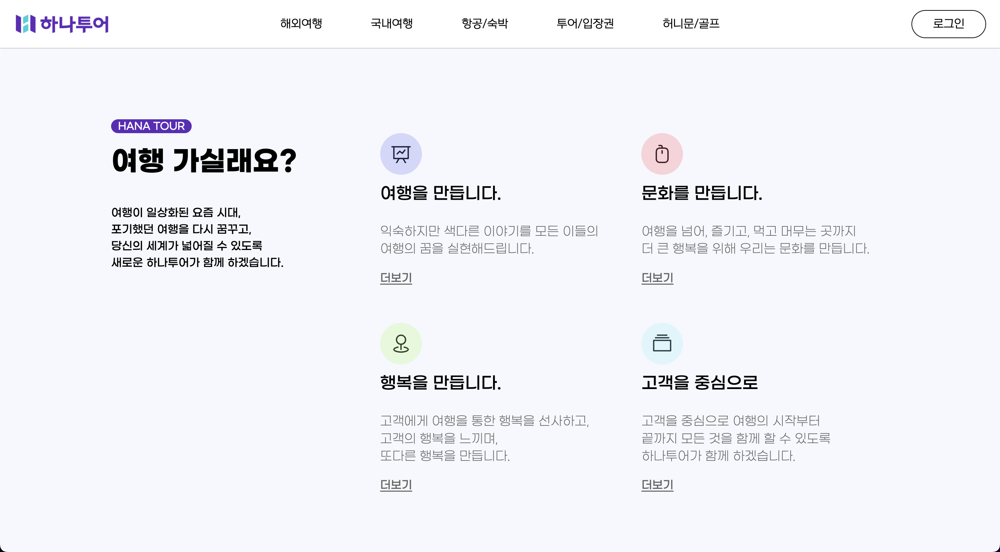
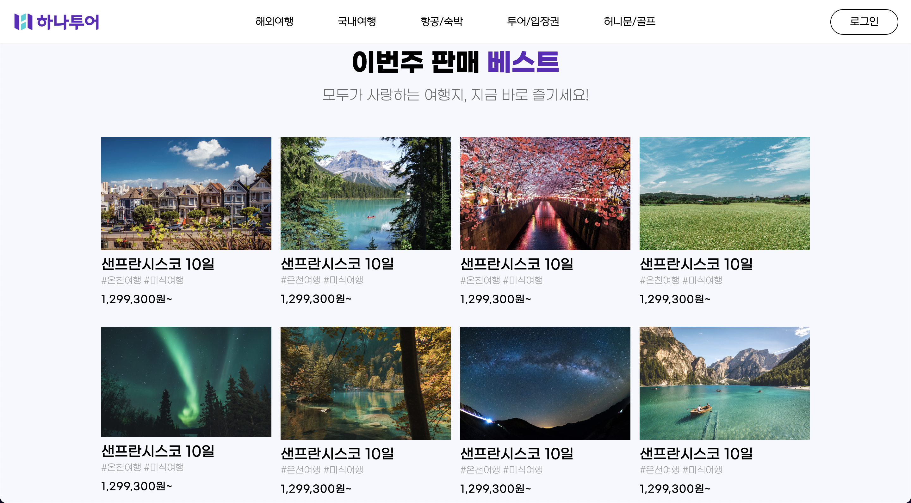
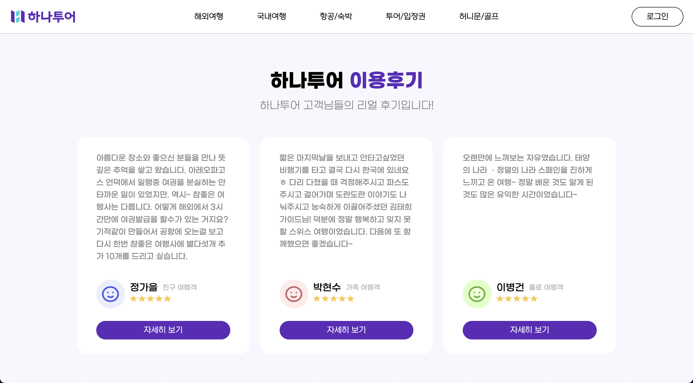
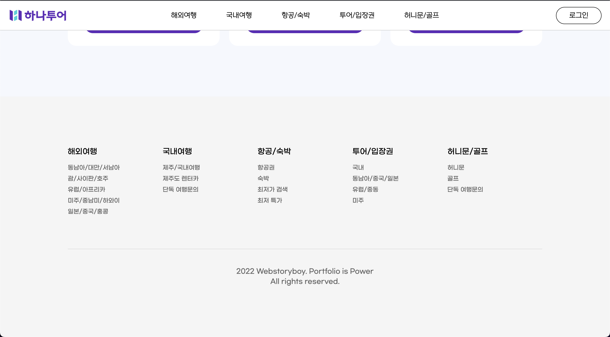

# 리액트 사이트 (React site) 
### 하나투어 여행 기업사이트를 리뉴얼하여 리액트로 처음 만든 사이트입니다.

   
  
  
  
  
  
  
   

## 구현 기능

<li>swiper 라이브러리를 활용하여 슬라이드 기능 구현</li> 

<li>각 요소들을 컴포넌트화하여 필요한 부분에 재활용</li> 

<li>부모 컴포넌트의 속성들을 자식 컴포넌트 필요한 부분에 활용</li> 

<li>다양한 디바이스에도 볼 수 있도록 반응형으로 작업</li> 
 

 

## 기술 스택

|    html    |     css    |     react.   |
| :--------: | :--------: | :--------:   |
|  ![html]   |   ![css]   |   ![react].  |

 

## 배운 점

<li>처음 react 라이브러리르 사용하면서 기본 세팅과 SPA 구조를 이해하였습니다.</li> 
<li>필요하고 많이 쓰이는 기능들을 컴포넌트로 만들어 재활용하고 유지보수가 용이하도록 하였습니다.</li> 
<li>부모 컴포넌트의 props를 활용하는 방법을 익혔습니다.</li> 
<li>가상의 Dom를 통해 필요한 부분만 렌더링하여 빠르고 사용자 경험을 높일 수 있다는 장점을 배웠습니다.</li> 

 

<!-- Stack Icon Refernces -->
[html]: /public/stack/html.svg
[css]: /public/stack/css.svg
[figma]: /public/stack/figma.svg
[ts]: /public/stack/typescript.svg
[react]: /public/stack/react.svg
[node]: /public/stack/node.svg

# Getting started with create React App

## 로우터 설정

npm install react-router-dom

## axios 설정 (API 데이터)

npm install axios

## gsap 설정

npm install gsap

## 이미지 슬라이드 설정

npm i swiper (i는 install 약자)

## sass 설정

npm install node-sass
